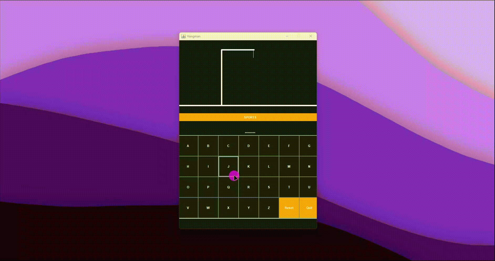

# Hangman (Java Swing)

This is a simple hangman game written in Java using Swing. It is a basic implementation of the classic hangman game,
where the player has to guess a word letter by letter.

### How to run this project?

To run this project on your local environment, follow the following steps :

- Clone the repository to your local machine or download the source code.
- Execute the `App.java` file to start the application.
- Enjoy the game!
